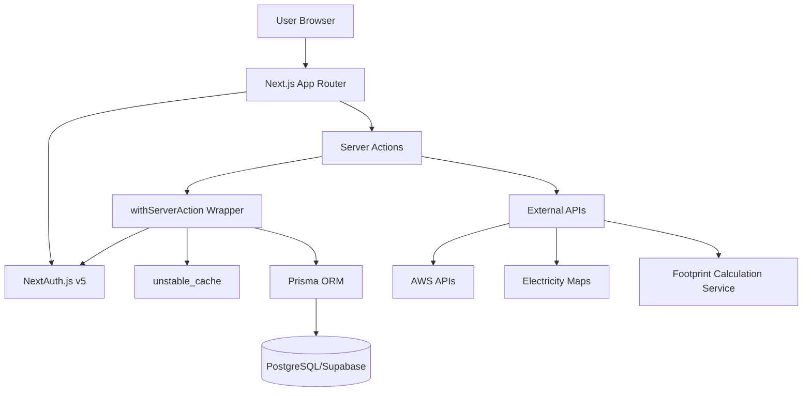
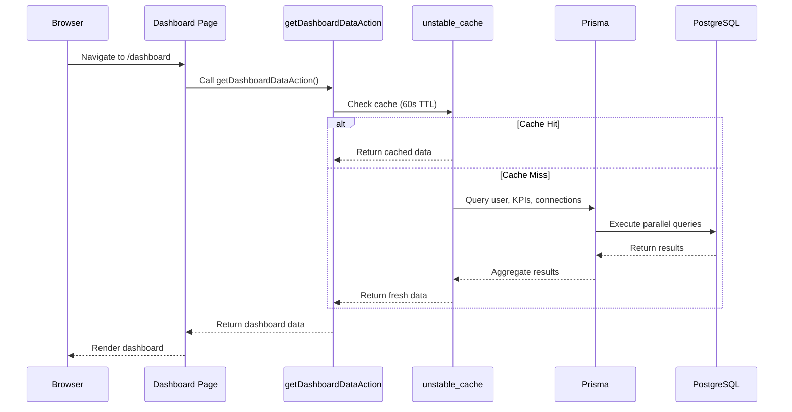
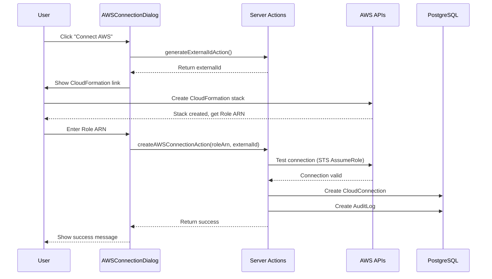

# Design Document: Core Dashboard Features

## Overview

The core dashboard features provide the foundation for GreenRatchet's cloud sustainability monitoring platform. This design covers three main areas:

1. **Dashboard Page** - A centralized overview showing KPI summaries, cloud connection status, and quick access to recent metrics
2. **Audit Logs** - A comprehensive audit trail system that records all significant actions and calculations
3. **Cloud Connections** - Secure integration with cloud providers (AWS, GCP, Azure) for automated data collection

The design follows Next.js 15 App Router patterns with Server Components, Server Actions, and Prisma ORM for database access. All features are built with organization-based multi-tenancy, ensuring data isolation between organizations.

## Architecture

### High-Level Architecture



### Technology Stack

- **Frontend**: Next.js 15 with App Router, React Server Components
- **Styling**: Tailwind CSS with shadcn/ui components
- **Authentication**: NextAuth.js v5 with session management
- **Backend**: Server Actions with `withServerAction` wrapper
- **Database**: PostgreSQL (Supabase) with Prisma ORM
- **Caching**: Next.js `unstable_cache` with configurable revalidation
- **External APIs**: AWS SDK, Electricity Maps API, custom footprint service

### Multi-Tenancy Model

The system uses organization-based multi-tenancy:

- Each user belongs to exactly one organization
- All data queries filter by `organizationId`
- Server Actions automatically inject organization context via `withServerAction`
- Database models include `organizationId` foreign keys with cascade delete

## Components and Interfaces

### Page Components

#### 1. Dashboard Page (`app/(dashboard)/dashboard/page.tsx`)

**Purpose**: Main landing page showing overview of sustainability tracking status

**Component Structure**:

```typescript
export default async function DashboardPage() {
  // Server Component - fetches data directly
  const result = await getDashboardDataAction();

  if (!result.success) {
    return <ErrorDisplay error={result.error} />;
  }

  return (
    <div className="space-y-6">
      <WelcomeHeader userName={result.data.userName} />
      <SummaryCards
        kpiCount={result.data.kpiCount}
        connectionCount={result.data.connectionCount}
      />
      <RecentKPIsList kpis={result.data.recentKPIs} />
    </div>
  );
}
```

**Sub-components**:

- `WelcomeHeader`: Displays personalized greeting
- `SummaryCards`: Shows KPI count and connection count in card layout
- `RecentKPIsList`: Displays up to 5 recent KPIs with links to analytics
- `EmptyState`: Shown when no KPIs exist, with CTA button

#### 2. Audit Logs Page (`app/(dashboard)/audit/page.tsx`)

**Purpose**: Display complete audit trail of system actions

**Component Structure**:

```typescript
export default async function AuditLogsPage() {
  const result = await getAuditLogsAction();

  if (!result.success) {
    return <ErrorDisplay error={result.error} />;
  }

  return (
    <div className="space-y-6">
      <PageHeader
        title="Audit Logs"
        description="Complete activity trail"
      />
      <AuditabilityInfoCard />
      <AuditLogsTable logs={result.data.logs} />
    </div>
  );
}
```

**Sub-components**:

- `AuditLogsTable`: Table displaying audit log entries with columns for action type, entity, user, details, and timestamp
- `ActionTypeBadge`: Color-coded badge for different action types
- `AuditabilityInfoCard`: Informational card explaining audit features
- `EmptyState`: Shown when no logs exist

#### 3. Cloud Connections Page (`app/(dashboard)/cloud/page.tsx`)

**Purpose**: Manage cloud provider integrations

**Component Structure**:

```typescript
export default async function CloudConnectionsPage() {
  const result = await getCloudConnectionsAction();

  if (!result.success) {
    return <ErrorDisplay error={result.error} />;
  }

  return (
    <div className="space-y-6">
      <PageHeader
        title="Cloud Connections"
        description="Connect cloud providers"
      />
      <InfoCards />
      <CloudProvidersList
        connections={result.data.connections}
      />
    </div>
  );
}
```

**Sub-components**:

- `CloudProvidersList`: Grid of cloud provider cards (AWS, GCP, Azure)
- `AWSConnectionCard`: Card with connection status and AWS-specific connection flow
- `GCPConnectionCard`: Card showing "Coming Soon" status
- `AzureConnectionCard`: Card showing "Coming Soon" status
- `AWSConnectionDialog`: Client component for AWS connection flow
- `DisconnectButton`: Client component for removing connections
- `InfoCards`: Cards explaining ESG data collection and carbon methodology

### Server Actions

All server actions follow this pattern:

```typescript
export const actionName = withServerAction(
  async (input: InputType, context: ActionContext) => {
    // context.user and context.organizationId automatically available
    // Cached for 5 minutes by default

    const data = await prisma.model.findMany({
      where: { organizationId: context.organizationId },
    });

    return { success: true, data };
  },
);
```

#### 1. `getDashboardDataAction` (`app/actions/dashboard/get-dashboard-data.ts`)

**Purpose**: Fetch dashboard overview data

**Input**: None (uses context.organizationId)

**Output**:

```typescript
{
  userName: string;
  kpiCount: number;
  connectionCount: number;
  recentKPIs: Array<{
    id: string;
    name: string;
    type: KPIType;
    targetValue: number;
    unit: string;
  }>;
}
```

**Implementation**:

- Query user name from session
- Count KPIs for organization
- Count active cloud connections for organization
- Fetch 5 most recent KPIs ordered by createdAt DESC
- Use `Promise.all` for parallel queries
- Cache with 60-second revalidation

#### 2. `getAuditLogsAction` (`app/actions/audit/get-audit-logs.ts`)

**Purpose**: Fetch audit log entries

**Input**: None (uses context.organizationId)

**Output**:

```typescript
{
  logs: Array<{
    id: string;
    actionType: string;
    entityType: string;
    entityId: string;
    userId: string | null;
    userName: string | null;
    details: Record<string, any>;
    createdAt: Date;
  }>;
}
```

**Implementation**:

- Query up to 100 most recent audit logs for organization
- Include user relation to get user names
- Order by createdAt DESC
- Parse JSON details field
- Cache with 5-minute revalidation

#### 3. `getCloudConnectionsAction` (`app/actions/cloud/get-cloud-connections.ts`)

**Purpose**: Fetch cloud connection status

**Input**: None (uses context.organizationId)

**Output**:

```typescript
{
  connections: Array<{
    id: string;
    cloudProvider: CloudProvider;
    status: string;
    lastSyncAt: Date | null;
    createdAt: Date;
  }>;
}
```

**Implementation**:

- Query all cloud connections for organization
- Order by cloudProvider
- Cache with 5-minute revalidation

#### 4. `createAWSConnectionAction` (`app/actions/cloud/create-aws-connection.ts`)

**Purpose**: Create AWS cloud connection

**Input**:

```typescript
{
  roleArn: string;
  externalId: string;
}
```

**Output**:

```typescript
{
  connectionId: string;
}
```

**Implementation**:

- Validate Role ARN format
- Test AWS connection using STS AssumeRole
- Verify access to CloudWatch and Cost Explorer
- Create CloudConnection record
- Create audit log entry (CLOUD_CONNECTION_CREATED)
- Return connection ID

#### 5. `disconnectCloudProviderAction` (`app/actions/cloud/disconnect-cloud-provider.ts`)

**Purpose**: Remove cloud provider connection

**Input**:

```typescript
{
  connectionId: string;
}
```

**Output**:

```typescript
{
  success: true;
}
```

**Implementation**:

- Verify connection belongs to user's organization
- Delete CloudConnection record (cascade deletes related data)
- Create audit log entry (CLOUD_CONNECTION_DISCONNECTED)
- Revalidate cache

#### 6. `triggerBackfillAction` (`app/actions/cloud/trigger-backfill.ts`)

**Purpose**: Trigger historical data sync

**Input**:

```typescript
{
  connectionId: string;
}
```

**Output**:

```typescript
{
  success: true;
}
```

**Implementation**:

- Verify connection belongs to user's organization
- Calculate date range (1 year back from today)
- Call footprint sync service with date range
- Create audit log entry (CLOUD_BACKFILL_TRIGGERED)
- Update lastSyncAt timestamp

#### 7. `generateExternalIdAction` (`app/actions/cloud/generate-external-id.ts`)

**Purpose**: Generate secure External ID for AWS IAM trust

**Input**: None

**Output**:

```typescript
{
  externalId: string;
}
```

**Implementation**:

- Generate cryptographically secure random string (32 characters)
- Return External ID (not stored until connection is created)

### Client Components

#### 1. `AWSConnectionDialog` (`components/cloud/aws-connection-dialog.tsx`)

**Purpose**: Handle AWS connection flow

**State**:

```typescript
{
  step: "generate" | "cloudformation" | "role-arn" | "validating";
  externalId: string | null;
  roleArn: string;
  error: string | null;
}
```

**Flow**:

1. User clicks "Connect AWS"
2. Generate External ID via `generateExternalIdAction`
3. Display CloudFormation launch link with pre-filled parameters
4. User creates stack in AWS console
5. User returns and enters Role ARN
6. Validate and create connection via `createAWSConnectionAction`
7. Show success message and close dialog

#### 2. `DisconnectButton` (`components/cloud/disconnect-button.tsx`)

**Purpose**: Handle cloud provider disconnection

**Behavior**:

- Show confirmation dialog before disconnecting
- Call `disconnectCloudProviderAction`
- Show success/error toast
- Refresh page data

## Data Models

### Existing Prisma Models (Relevant to Core Features)

#### User

```prisma
model User {
  id             String       @id @default(cuid())
  name           String?
  email          String       @unique
  organizationId String
  organization   Organization @relation(fields: [organizationId], references: [id], onDelete: Cascade)
  createdAt      DateTime     @default(now())
  updatedAt      DateTime     @updatedAt
}
```

#### Organization

```prisma
model Organization {
  id        String   @id @default(cuid())
  name      String
  createdAt DateTime @default(now())
  updatedAt DateTime @updatedAt
  users     User[]
  kpis      KPI[]
  connections CloudConnection[]
  auditLogs AuditLog[]
}
```

#### KPI

```prisma
model KPI {
  id             String       @id @default(cuid())
  name           String
  type           KPIType
  targetValue    Float
  unit           String
  organizationId String
  organization   Organization @relation(fields: [organizationId], references: [id], onDelete: Cascade)
  createdAt      DateTime     @default(now())
  updatedAt      DateTime     @updatedAt
}
```

#### CloudConnection

```prisma
model CloudConnection {
  id             String        @id @default(cuid())
  cloudProvider  CloudProvider
  status         String        @default("ACTIVE")
  credentials    Json          // Encrypted credentials
  externalId     String?       // For AWS
  roleArn        String?       // For AWS
  lastSyncAt     DateTime?
  organizationId String
  organization   Organization  @relation(fields: [organizationId], references: [id], onDelete: Cascade)
  createdAt      DateTime      @default(now())
  updatedAt      DateTime      @updatedAt
  footprints     CloudFootprint[]
}

enum CloudProvider {
  AWS
  GCP
  AZURE
}
```

#### AuditLog

```prisma
model AuditLog {
  id             String       @id @default(cuid())
  actionType     String       // KPI_CREATED, CLOUD_CONNECTION_CREATED, etc.
  entityType     String       // KPI, CloudConnection, etc.
  entityId       String
  userId         String?
  user           User?        @relation(fields: [userId], references: [id], onDelete: SetNull)
  details        Json
  organizationId String
  organization   Organization @relation(fields: [organizationId], references: [id], onDelete: Cascade)
  createdAt      DateTime     @default(now())
}
```

### Data Flow Diagrams

#### Dashboard Data Flow



#### AWS Connection Flow



## Correctness Properties

_A property is a characteristic or behavior that should hold true across all valid executions of a system—essentially, a formal statement about what the system should do. Properties serve as the bridge between human-readable specifications and machine-verifiable correctness guarantees._

### Property 1: Unauthenticated Access Redirect

_For any_ protected dashboard route, when accessed without authentication, the system should redirect to the sign-in page.

**Validates: Requirements 1.1**

### Property 2: Organization Membership Required

_For any_ authenticated user without organization membership, attempts to access dashboard features should be prevented.

**Validates: Requirements 1.2**

### Property 3: Organization Data Isolation

_For any_ user belonging to an organization, all data queries should return only data belonging to that user's organization and no data from other organizations.

**Validates: Requirements 1.3, 1.4**

### Property 4: Dashboard Count Accuracy

_For any_ organization, the displayed KPI count and cloud connection count should match the actual number of KPIs and active connections in the database for that organization.

**Validates: Requirements 2.2, 2.3**

### Property 5: Recent KPIs Display Correctness

_For any_ organization with KPIs, the dashboard should display up to 5 most recent KPIs ordered by creation date, and each displayed KPI should include name, type, target value, and unit.

**Validates: Requirements 2.4**

### Property 6: Dashboard Cache Behavior

_For any_ dashboard data request, repeated requests within 60 seconds should return cached data, and requests after 60 seconds should fetch fresh data from the database.

**Validates: Requirements 2.6, 8.2**

### Property 7: Audit Log Creation for All Actions

_For any_ significant system action (KPI creation, KPI calculation, cloud connection creation, cloud connection disconnection, cloud backfill), an audit log entry with the appropriate action type should be created.

**Validates: Requirements 3.1, 3.2, 3.3, 3.4, 3.5, 6.3**

### Property 8: Audit Log Required Fields

_For any_ audit log entry, it should contain all required fields: action type, entity type, entity ID, details (as valid JSON), timestamp, and organization ID. User-initiated actions should include user ID, while system-initiated actions should have null user ID.

**Validates: Requirements 3.6, 3.7, 3.8, 3.9**

### Property 9: Audit Log Organization Filtering

_For any_ organization, the audit logs page should display only audit log entries belonging to that organization, limited to the 100 most recent entries ordered by creation date descending.

**Validates: Requirements 4.1**

### Property 10: Audit Log Display Completeness

_For any_ displayed audit log entry, the rendered output should include the action type, entity information, user name (or system indicator), parsed details, and formatted timestamp.

**Validates: Requirements 4.3, 4.4, 4.5**

### Property 11: Cloud Connection Display Accuracy

_For any_ connected cloud provider, the displayed information should include connection status, details, and last sync time matching the database record.

**Validates: Requirements 5.2**

### Property 12: External ID Security

_For any_ generated External ID for AWS connections, it should be a cryptographically secure random string of at least 32 characters.

**Validates: Requirements 5.4**

### Property 13: AWS Role ARN Validation

_For any_ provided AWS Role ARN, the system should validate the connection by attempting to assume the role before storing the connection. Invalid ARNs or ARNs without necessary permissions should be rejected.

**Validates: Requirements 5.7, 7.3**

### Property 14: Cloud Disconnection Completeness

_For any_ cloud connection disconnection request, the system should both remove the connection from the database and create an audit log entry with action type CLOUD_CONNECTION_DISCONNECTED.

**Validates: Requirements 5.8**

### Property 15: Backfill Date Range Calculation

_For any_ backfill operation, the system should calculate a date range of exactly 1 year back from the current date.

**Validates: Requirements 6.2**

### Property 16: Backfill Sync Time Update

_For any_ completed backfill operation, the cloud connection's lastSyncAt timestamp should be updated to the completion time.

**Validates: Requirements 6.4**

### Property 17: AWS Connection Authentication Method

_For any_ AWS cloud connection, it should store both an External ID and a Role ARN for IAM role-based authentication.

**Validates: Requirements 7.1**

### Property 18: Server Action Cache Behavior

_For any_ server action wrapped with withServerAction, repeated calls within 5 minutes should return cached results.

**Validates: Requirements 8.1**

### Property 19: Error Message Display

_For any_ error that occurs during data fetching or action execution, the system should display a user-friendly error message to the user.

**Validates: Requirements 9.5**

### Property 20: External API Error Handling

_For any_ external API call failure (Electricity Maps, AWS APIs, footprint service), the system should handle the error gracefully without crashing and log the failure.

**Validates: Requirements 10.5**

## Error Handling

### Error Categories

1. **Authentication Errors**
   - Unauthenticated access → Redirect to sign-in
   - Missing organization → Display error message and prevent access
   - Session expired → Redirect to sign-in with message

2. **Authorization Errors**
   - Cross-organization access attempt → Return 403 Forbidden
   - Invalid connection ID → Return 404 Not Found

3. **Validation Errors**
   - Invalid Role ARN format → Display validation error
   - AWS connection test failure → Display specific error from AWS
   - Missing required fields → Display field-specific errors

4. **External API Errors**
   - AWS API timeout → Retry with exponential backoff, then display error
   - Electricity Maps API failure → Log error, use cached data if available
   - Footprint service unavailable → Display error, allow retry

5. **Database Errors**
   - Connection failure → Display generic error, log details
   - Constraint violation → Display user-friendly message
   - Transaction failure → Rollback and display error

### Error Response Format

All server actions return consistent error format:

```typescript
{
  success: false;
  error: string; // User-friendly message
}
```

### Error Logging

- All errors logged to console with full stack trace
- Critical errors (auth, database) logged to audit trail
- External API errors logged with request/response details
- User-facing errors sanitized to prevent information leakage

## Testing Strategy

### Dual Testing Approach

The testing strategy combines unit tests for specific examples and edge cases with property-based tests for universal properties. This ensures comprehensive coverage:

- **Unit tests** verify specific examples, edge cases, and error conditions
- **Property tests** verify universal properties across all inputs through randomization
- Both approaches are complementary and necessary

### Unit Testing Focus

Unit tests should focus on:

- Specific examples that demonstrate correct behavior (e.g., dashboard displays welcome message)
- Integration points between components (e.g., server actions calling Prisma)
- Edge cases (e.g., empty states, zero KPIs, no connections)
- Error conditions (e.g., invalid Role ARN, API failures)

Avoid writing too many unit tests for scenarios that property-based tests can cover through randomization.

### Property-Based Testing Configuration

- **Library**: Use `fast-check` for TypeScript/JavaScript property-based testing
- **Iterations**: Minimum 100 iterations per property test
- **Tagging**: Each property test must reference its design document property
- **Tag Format**: `// Feature: core-dashboard-features, Property {number}: {property_text}`

### Property Test Examples

**Property 3: Organization Data Isolation**

```typescript
// Feature: core-dashboard-features, Property 3: Organization Data Isolation
it("should isolate data between organizations", async () => {
  await fc.assert(
    fc.asyncProperty(
      fc.array(organizationArbitrary(), { minLength: 2, maxLength: 5 }),
      fc.array(kpiArbitrary(), { minLength: 1, maxLength: 10 }),
      async (organizations, kpis) => {
        // Setup: Create organizations and assign KPIs
        const createdOrgs = await Promise.all(
          organizations.map((org) => prisma.organization.create({ data: org })),
        );

        const kpisWithOrgs = kpis.map((kpi, idx) => ({
          ...kpi,
          organizationId: createdOrgs[idx % createdOrgs.length].id,
        }));

        await Promise.all(
          kpisWithOrgs.map((kpi) => prisma.kpi.create({ data: kpi })),
        );

        // Test: Query each organization's data
        for (const org of createdOrgs) {
          const result = await getDashboardDataAction(
            {},
            { organizationId: org.id, user: mockUser },
          );

          // Verify: Only returns data for this organization
          const expectedKpiCount = kpisWithOrgs.filter(
            (k) => k.organizationId === org.id,
          ).length;

          expect(result.data.kpiCount).toBe(expectedKpiCount);

          // Verify: No data from other organizations
          const otherOrgKpis = kpisWithOrgs.filter(
            (k) => k.organizationId !== org.id,
          );

          for (const otherKpi of otherOrgKpis) {
            expect(result.data.recentKPIs).not.toContainEqual(
              expect.objectContaining({ id: otherKpi.id }),
            );
          }
        }
      },
    ),
    { numRuns: 100 },
  );
});
```

**Property 7: Audit Log Creation for All Actions**

```typescript
// Feature: core-dashboard-features, Property 7: Audit Log Creation for All Actions
it("should create audit logs for all significant actions", async () => {
  await fc.assert(
    fc.asyncProperty(
      fc.constantFrom(
        "KPI_CREATED",
        "KPI_CALCULATED",
        "CLOUD_CONNECTION_CREATED",
        "CLOUD_CONNECTION_DISCONNECTED",
        "CLOUD_BACKFILL_TRIGGERED",
      ),
      organizationArbitrary(),
      async (actionType, organization) => {
        const org = await prisma.organization.create({ data: organization });

        const auditLogCountBefore = await prisma.auditLog.count({
          where: { organizationId: org.id },
        });

        // Trigger action based on type
        switch (actionType) {
          case "KPI_CREATED":
            await createKPIAction({ ...mockKPI, organizationId: org.id });
            break;
          case "CLOUD_CONNECTION_CREATED":
            await createAWSConnectionAction({
              ...mockConnection,
              organizationId: org.id,
            });
            break;
          // ... other cases
        }

        const auditLogCountAfter = await prisma.auditLog.count({
          where: { organizationId: org.id },
        });

        // Verify: Audit log was created
        expect(auditLogCountAfter).toBe(auditLogCountBefore + 1);

        // Verify: Audit log has correct action type
        const latestLog = await prisma.auditLog.findFirst({
          where: { organizationId: org.id },
          orderBy: { createdAt: "desc" },
        });

        expect(latestLog?.actionType).toBe(actionType);
      },
    ),
    { numRuns: 100 },
  );
});
```

### Test Organization

```
tests/
  unit/
    dashboard/
      dashboard-page.test.tsx
      summary-cards.test.tsx
      recent-kpis-list.test.tsx
    audit/
      audit-logs-page.test.tsx
      audit-logs-table.test.tsx
    cloud/
      cloud-connections-page.test.tsx
      aws-connection-dialog.test.tsx
  property/
    dashboard/
      dashboard-data-isolation.property.test.ts
      dashboard-counts.property.test.ts
      dashboard-cache.property.test.ts
    audit/
      audit-log-creation.property.test.ts
      audit-log-fields.property.test.ts
      audit-log-filtering.property.test.ts
    cloud/
      aws-connection-validation.property.test.ts
      external-id-generation.property.test.ts
      backfill-date-range.property.test.ts
  integration/
    aws-connection-flow.test.ts
    audit-trail-end-to-end.test.ts
```

### Test Data Generators (Arbitraries)

For property-based testing, create generators for domain objects:

```typescript
// test/arbitraries/organization.ts
export const organizationArbitrary = () =>
  fc.record({
    name: fc.string({ minLength: 1, maxLength: 100 }),
  });

// test/arbitraries/kpi.ts
export const kpiArbitrary = () =>
  fc.record({
    name: fc.string({ minLength: 1, maxLength: 100 }),
    type: fc.constantFrom(...Object.values(KPIType)),
    targetValue: fc.float({ min: 0, max: 1000000 }),
    unit: fc.constantFrom("kg", "kWh", "liters", "%"),
  });

// test/arbitraries/cloud-connection.ts
export const awsConnectionArbitrary = () =>
  fc.record({
    cloudProvider: fc.constant("AWS"),
    roleArn: fc
      .string({ minLength: 20, maxLength: 100 })
      .map((s) => `arn:aws:iam::123456789012:role/${s}`),
    externalId: fc.hexaString({ minLength: 32, maxLength: 32 }),
  });
```

### Mocking Strategy

- **Database**: Use test database with transactions (rollback after each test)
- **External APIs**: Mock AWS SDK, Electricity Maps API, footprint service
- **Authentication**: Mock NextAuth session for authenticated tests
- **Time**: Mock Date.now() for cache and timestamp tests

### CI/CD Integration

- Run unit tests on every commit
- Run property tests on every PR
- Run integration tests before merge
- Require 80% code coverage for new code
- Run tests in parallel for faster feedback
